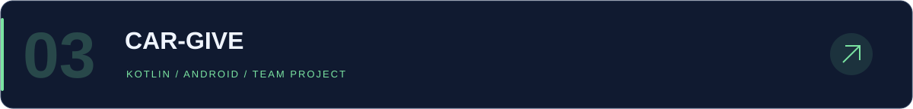

### 정현수 · AI / SW

  
  
  
  
  
  
  
  

**데이터를 수집하고 검증해, 사용자가 쓸 수 있는 서비스로 연결합니다.**

컴퓨터공학을 전공하고 **SSAFY 16기 데이터 트랙**에서 학습하고 있습니다. Android와 Unity 개발 경험을 바탕으로 데이터 처리와 웹 서비스로 개발 영역을 넓히며, **AI/SW 직무**를 준비하고 있습니다.

[프로젝트 살펴보기](#selected-projects) · [기술 스택](#tech-stack) · [개발 경험](#experience)

 

## Selected Projects

**서울·경기 지역정보를 검색하고 대화·지도·커뮤니티로 연결하는 협업 프로젝트**

**담당 역할** — 팀 아이디어를 취합해 요구사항을 정리하고, AI 개발 도구에 전달할 구현용 프롬프트를 작성했습니다. 팀원들과 AI를 활용해 공동 개발했습니다. 아래는 팀이 함께 구현한 기능입니다.

| 프로젝트 기능 | 구현 내용 |
| :--- | :--- |
| AI 챗봇 | 대화 이력에서 지역·유형 조건을 이어받는 멀티턴 검색, OpenAI 연동 실패 시 로컬 검색으로 대체 |
| 경로 탐색 | OpenStreetMap·Overpass 도로망 기반 A* 경로 계산, 반복 경로 조회 캐시 |
| 응답 흐름 | 챗봇 응답과 경로 계산을 분리해 외부 경로 API 지연이 대화 응답에 영향을 주는 범위 축소 |
| 지역 데이터 | TourAPI 기반 서울·경기 지역정보, 검색·필터·서버 페이지네이션 |
| 커뮤니티 | 게시글·댓글·북마크, WebSocket 새 게시글 알림, 통계 대시보드 |

`Vue 3` `TypeScript` `FastAPI` `SQLAlchemy` `SQLite` `OpenAI API` `WebSocket`

[**Repository ↗**](https://github.com/Moon-ye-rin/LocalHub) · [챗봇 코드](https://github.com/Moon-ye-rin/LocalHub/blob/master/backend/app/services/chat_service.py) · [경로 탐색 코드](https://github.com/Moon-ye-rin/LocalHub/blob/master/backend/app/services/route_service.py)

 

**탄소중립을 타일 게임의 규칙과 시각 효과로 풀어낸 교육형 캐주얼 게임**

- **게임 시스템** — 타일 입력·점수·탄소 게이지, 피버 모드, 조력자·방해자, 스테이지·챌린지
- **서비스 기능** — 경험치·골드 서버 반영, 랭킹, 탄소중립 스토리와 로딩 정보
- **확인된 개인 기여** — 자동 로그인, 아이디 저장, ESC 프롬프트 구현 ([PR #14](https://github.com/MobileGameInha/Capstone-Mobile-Game/pull/14))
- **성과** — 캡스톤 프로젝트 우수상 *(기존 포트폴리오 기재)*

`Unity` `C#` `Mobile Game` `Team Project`

[**Repository ↗**](https://github.com/MobileGameInha/Capstone-Mobile-Game) · [게임 구성·실행 참고](https://github.com/MobileGameInha/Capstone-Mobile-Game/blob/main/README.md)

 

**Kotlin 기반 Android 팀 프로젝트**

로그인·메인 화면의 Activity 구조와 Android UI 구성을 확인할 수 있는 저장소입니다. 프로젝트 의존성에 Retrofit·OkHttp·Gson·ViewModel이 구성되어 있습니다.

`Kotlin` `Android` `Gradle`

[**Repository ↗**](https://github.com/Car-Give/Android) · [앱 구성](https://github.com/Car-Give/Android/blob/master/app/build.gradle)

 

**데이터·AI·SW 신입 채용 공고를 모으는 채용 보드**

공식 채용 정보를 수집하고, 신입 지원 가능 여부와 마감 상태를 검증해 게시하는 서비스입니다.

| 핵심 영역 | 프로젝트에 구현된 내용 |
| :--- | :--- |
| 데이터 수집 | 공식 채용 API, 채용 페이지, JSON-LD와 사이트맵을 활용한 공고 탐색 |
| 데이터 검증 | 공식 도메인·직무 역량·신입/인턴 조건·마감 상태 확인 |
| 예외 처리 | 원문 접근 실패 시 기존 공고를 즉시 삭제하지 않고 검토 큐에 기록 |
| 운영 자동화 | GitHub Actions를 이용한 정기 수집·갱신 |

`Python` `TypeScript` `React` `GitHub Actions`

[**Repository ↗**](https://github.com/yeoroJeong/Data_next) · [수집·검증 코드](https://github.com/yeoroJeong/Data_next/blob/main/automation/update_jobs.py)

 

**풀이 제출부터 리뷰까지 이어지는 알고리즘 스터디**

주차별 문제 풀이와 코드 리뷰를 함께 기록하는 팀 저장소입니다. 개인 풀이와 함께, 반복되는 스터디 운영을 자동화한 구조를 확인할 수 있습니다.

- **문제 해결** — Python 풀이를 문제·주차별로 정리하고 접근 방법을 공유
- **협업 흐름** — PR 템플릿과 리뷰 가이드로 풀이 설명과 피드백을 구조화
- **반복 작업 자동화** — 주차 폴더 생성, 경로·문법·PR 형식 검사, 제출 현황 정리

`Python` `Git` `GitHub Actions` `Code Review`

[**Repository ↗**](https://github.com/yeoroJeong/algorithm-study-code-review) · [자동화 스크립트](https://github.com/yeoroJeong/algorithm-study-code-review/tree/main/scripts) · [리뷰 가이드](https://github.com/yeoroJeong/algorithm-study-code-review/blob/main/docs/review-guide.md)

 

**문제 조건에서 알고리즘 선택까지 연결하는 학습 가이드**

- 그래프 탐색·최단 경로·Union-Find·구간 질의 등 유형별 판단 기준 정리
- C++ STL의 사용 조건, 시간복잡도, API형 풀이 패턴 비교
- 검색·유형별 탐색·코드 예시 모달을 갖춘 웹 페이지 구성

`HTML` `CSS` `JavaScript` · 학습 주제: `C++` `Algorithms`

[**Repository ↗**](https://github.com/yeoroJeong/Algorithm_Pro_Tips)

 

## Tech Stack

**프로젝트에서 활용한 기술**

| 영역 | 활용 경험 |
| :--- | :--- |
| AI & Backend (LocalHub 팀 스택) | OpenAI API 연동, FastAPI·SQLAlchemy·SQLite, WebSocket |
| Data & Automation | Python 기반 데이터 수집·검증, 정기 실행 워크플로 |
| Web | TypeScript·React 기반 서비스 화면, LocalHub의 Vue 3, HTML·CSS·JavaScript 학습 도구 |
| Mobile & Game | Kotlin·Android UI 및 REST API 연동, Unity·C# 게임 로직 |
| Collaboration | Git 브랜치, Pull Request, 코드 리뷰, 가이드 문서 |

**학습 중** · Java, C++, MySQL·SQL, 자료구조·알고리즘, 데이터 처리 기초

 

## Experience

- **SSAFY 16기 · 데이터 트랙** — 알고리즘, 데이터베이스, Python·Java, Git 학습
- **Android 애플리케이션** — RecyclerView 목록, 화면 전환, 카메라·갤러리, REST API 연동 경험
- **Unity 2D 캡스톤 프로젝트** — 탄소중립 타일 게임 · 자동 로그인, 아이디 저장, ESC 프롬프트 구현 · **캡스톤 프로젝트 우수상**

[기존 포트폴리오 소스 ↗](https://github.com/yeoroJeong/profile/tree/master/Portfolio)

---

사용자 화면부터 데이터 처리까지, 서비스의 흐름을 이해하며 성장하고 있습니다.

